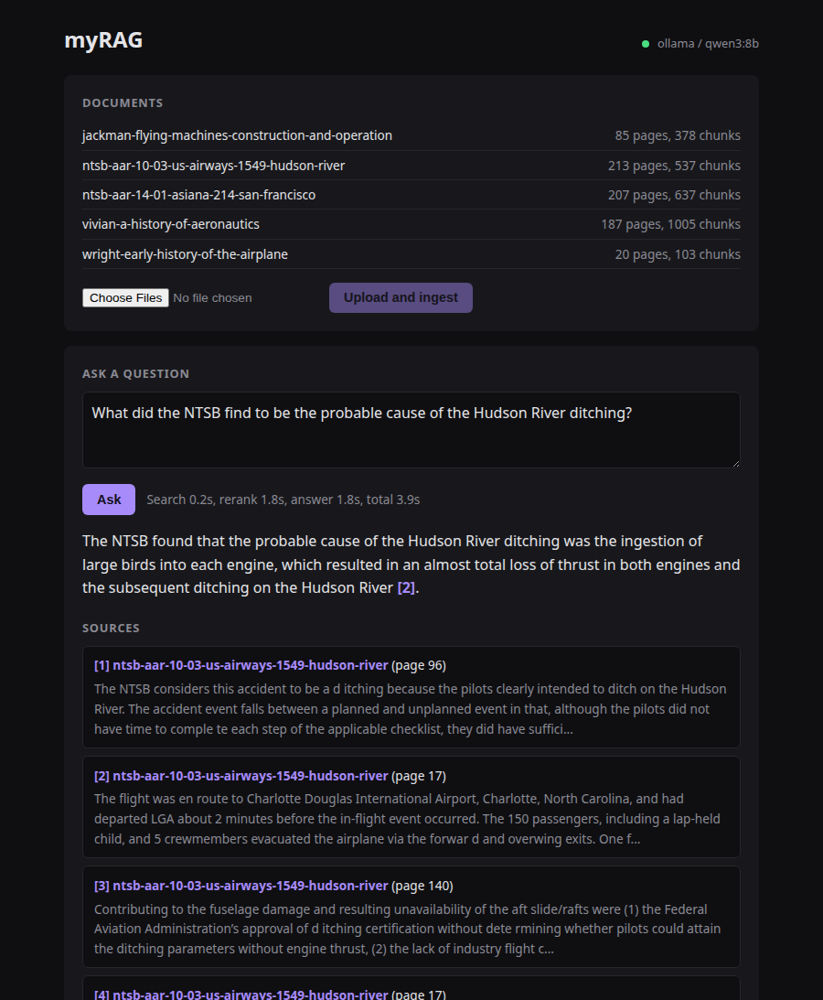
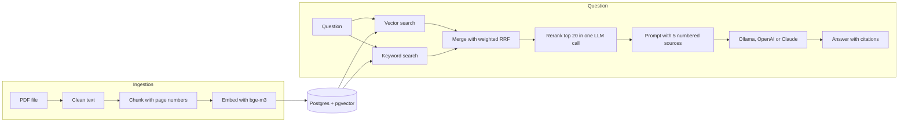

# myRAG

Ask questions about your own PDF documents and get answers that cite the page they come from.

It runs fully on your own machine with Ollama and Postgres, or with a hosted model from OpenAI or Anthropic. Search quality is measured with a test set, and the results are below.



## What it does

- **Ingests PDFs.** Text is cleaned, split into chunks that remember their page numbers, embedded with `bge-m3` and stored in Postgres with pgvector.
- **Hybrid search.** Every question runs a vector search and a keyword search. The two result lists are merged with weighted Reciprocal Rank Fusion (RRF).
- **Reranking in one model call.** The model sees the 20 best candidates at once and returns their order. The top 5 become the sources.
- **Answers with citations.** The model answers only from the numbered sources and cites them as `[1]`, `[2]`. In the web page each citation links to its source and page.
- **Three model providers.** One setting switches between a local Ollama model, OpenAI and Anthropic Claude.
- **Evaluation.** A script reports hit rate, MRR and faithfulness for four search setups, so every change to the pipeline can be measured.

## How it works



## Results

Measured on 46 questions about five public domain documents (2,660 chunks): three early aviation books and two NTSB accident reports. A question counts as a hit when a chunk containing the expected evidence is among the top 5.

| Search setup | Hit rate@5 | MRR@5 | Faithfulness | Avg search time |
|---|---|---|---|---|
| Vector search only | 0.78 | 0.50 | not measured | 0.19 s |
| Keyword search only | 0.65 | 0.34 | not measured | 0.02 s |
| Hybrid (vector + keyword) | 0.74 | 0.55 | not measured | 0.20 s |
| **Hybrid + reranking** (default) | **0.85** | **0.74** | **0.98** | 2.25 s |

Reranking is what makes the difference: it finds a relevant chunk for 85% of the questions and usually puts it first or second. A full answer takes about 4 to 7 seconds on the laptop GPU.

Setup for these numbers: `bge-m3` embeddings, `qwen3:8b` for reranking, answering and judging, all running locally on a laptop GPU with 8 GB of memory.

- **Hit rate@5:** share of questions with a relevant chunk in the top 5.
- **MRR@5:** how high the first relevant chunk ranks on average (1.0 means always first).
- **Faithfulness:** share of the claims in an answer that the retrieved sources support, judged by the model.

### What the measurements taught me

1. **Check chunk sizes on real PDFs.** PDF text has no blank lines, so my paragraph splitter treated every page as one paragraph. Chunks were about 5,600 characters instead of the 1,000 I had configured. Splitting long paragraphs into sentences fixed it.
2. **Hybrid search is not automatically better.** With equal weights, the merged result was no better than vector search alone, because keyword search was the weaker of the two on this data. Giving keyword hits a weight of 0.3 gave the best ranking.
3. **Chunks need to know which document they belong to.** A chunk from the middle of a report does not repeat the flight number. Adding the document title to the text that is embedded and indexed raised the vector hit rate from 0.70 to 0.78 and the keyword hit rate from 0.54 to 0.65.
4. **Prompt order matters for a small reranker.** With the question only after the passages, reranking barely helped (hit rate 0.74). With the question before and after the passages it reached about 0.85.
5. **Local model defaults can hide problems.** Ollama's default context of 4,096 tokens silently cut off the rerank prompt. The model's thinking mode made a rerank call take about 8 seconds instead of 2. Both are now settings.
6. **Tables of contents are noise.** They contain the words of every section title, so they matched many questions without answering any. Those pages are skipped at ingestion.

### Limits of these numbers

- The test set is small, and I tuned the pipeline on the same questions. Expect lower numbers on new documents.
- The judge for faithfulness is the same small local model that wrote the answers.
- A hit is counted by matching an evidence phrase. A chunk that answers the question in other words counts as a miss. Two of the seven misses still produced a correct answer for that reason.
- When the search finds nothing useful, the model says it could not find the answer instead of guessing. That happened for three of the seven misses.

## Quick start with Docker

You need Docker and [Ollama](https://ollama.com) running on your machine.

```bash
ollama pull bge-m3        # embeddings, 1.2 GB
ollama pull qwen3:8b      # answers, 5.2 GB

git clone https://github.com/codeplated/myRAG.git
cd myRAG
docker compose up --build
```

Open http://localhost:8000, upload a PDF and ask a question.

On Linux, Ollama has to accept connections from Docker. Set `OLLAMA_HOST=0.0.0.0:11434` for the Ollama service if the app cannot reach it.

### Use a hosted model instead

Embeddings always run locally through Ollama. Only the answering model changes. Copy `.env.example` to `.env` and set:

```bash
# OpenAI
LLM_PROVIDER=openai
OPENAI_API_KEY=...

# or Anthropic
LLM_PROVIDER=anthropic
ANTHROPIC_API_KEY=...
```

The OpenAI and Anthropic code paths are covered by automated tests against a fake API server. I have not run them against the real services.

### Load the sample documents

```bash
pip install -r requirements-dev.txt
python scripts/fetch_sample_data.py              # downloads to data/books
PYTHONPATH=src python -m rag_pipeline.ingest_books
```

## Run locally for development

```bash
python -m venv .venv && source .venv/bin/activate
make install                      # app and development tools
cp .env.example .env
docker compose up -d pgvector     # database only
make run                          # app with auto-reload on http://localhost:8000
```

Run `make help` to see all commands.

`docker compose --profile tools up` also starts pgAdmin and Jupyter. The notebook in `notebooks/` plots the stored chunks in 3D.

## Configuration

All settings are environment variables with working defaults. The full list with comments is in [.env.example](.env.example). The most important ones:

| Setting | Default | Meaning |
|---|---|---|
| `LLM_PROVIDER` | `ollama` | `ollama`, `openai` or `anthropic` |
| `LLM_MODEL` | `qwen3:8b` | Ollama model for answers and reranking |
| `EMBEDDING_MODEL` | `bge-m3` | Ollama embedding model |
| `CHUNK_SIZE` / `CHUNK_OVERLAP` | `1000` / `200` | Chunk size and overlap in characters |
| `SEARCH_MODE` | `hybrid` | `hybrid`, `vector` or `keyword` |
| `KEYWORD_WEIGHT` | `0.3` | Weight of keyword hits in the merge |
| `RERANK_MODE` | `llm` | `llm` or `none` |
| `RERANK_CANDIDATES` / `RERANK_TOP_K` | `20` / `5` | Chunks the reranker sees, and chunks used as sources |
| `PROMPT_TEMPLATE` | `default` | A file in `config/prompts` |

After changing the embedding model, re-create the table: `python -m rag_pipeline.ingest_books --reset`.

## API

| Method | Path | Purpose |
|---|---|---|
| `GET` | `/` | Web page |
| `GET` | `/health` | Database status and configured models |
| `GET` | `/documents` | Ingested documents with page and chunk counts |
| `POST` | `/upload` | Upload and ingest PDF files (multipart field `files`) |
| `POST` | `/query` | Ask a question, get the full answer as JSON |
| `POST` | `/query/stream` | Same, streamed as server-sent events |

```bash
curl -X POST http://localhost:8000/query \
  -H 'Content-Type: application/json' \
  -d '{"query": "What was the probable cause of the Hudson River ditching?"}'
```

```json
{
  "answer": "The probable cause was the ingestion of large birds into each engine ... [1].",
  "sources": [
    {"number": 1, "book_id": "ntsb-aar-10-03-us-airways-1549-hudson-river",
     "page_start": 17, "page_end": 17, "content_preview": "..."}
  ],
  "timings": {"retrieval_seconds": 0.2, "rerank_seconds": 2.1, "generation_seconds": 2.8}
}
```

Interactive API docs are at http://localhost:8000/docs.

## Evaluation

```bash
make eval            # compare vector, keyword, hybrid and hybrid+rerank
make eval-answers    # also generate answers and judge their faithfulness
```

Test questions live in [eval/questions.jsonl](eval/questions.jsonl), one per line:

```json
{"id": "hudson-06", "question": "How high was the aircraft when it struck the birds?",
 "book_id": "ntsb-aar-10-03-us-airways-1549-hudson-river",
 "evidence": ["2,818 feet"], "reference": "2,818 feet above ground level."}
```

A chunk is relevant when it comes from `book_id` and contains one of the `evidence` phrases. Matching on phrases instead of chunk ids keeps the test set valid when the chunking changes. To evaluate your own documents, write a file in the same format and pass it with `--questions`.

## Tests

```bash
make test       # unit tests: no database, no network, no API keys
make test-db    # database tests against a throwaway database called rag_test
make lint
```

The unit tests start a small fake server that speaks the Ollama, OpenAI and Anthropic HTTP APIs, so the real client code is exercised without calling a real service. GitHub Actions runs lint, the unit tests and the database tests on every push.

## Project layout

```
app/                    FastAPI app and the web page
src/rag_pipeline/
  pdf_loader.py         read PDF pages
  text_cleaning.py      clean page text, skip tables of contents
  chunking.py           split into chunks with page numbers
  embeddings_ollama.py  embeddings through Ollama
  db_pgvector.py        schema, inserts, document list
  retrieval.py          vector search, keyword search, RRF merge
  reranker.py           rerank candidates in one LLM call
  llm/                  Ollama, OpenAI and Anthropic behind one interface
  query.py              the question pipeline
  evaluate.py           hit rate, MRR, faithfulness
  ingest_books.py       command line ingestion
config/prompts/         prompt templates
eval/questions.jsonl    test questions
scripts/                sample data download
tests/                  unit and database tests
```

## Design decisions

- **Postgres for everything.** pgvector handles vector search and Postgres full-text search handles keywords, so there is one database to run and back up.
- **RRF to merge results.** Vector distances and keyword scores are on different scales. RRF only uses ranks, so no score normalisation is needed.
- **The LLM as reranker.** A dedicated reranker model would be faster. Using the answering model keeps the setup to two models and works with every provider.
- **Sizes in characters.** Chunk sizes are counted in characters, not tokens. That is simple and independent of the model. 1,000 characters are roughly 250 tokens.
- **No framework.** The pipeline is plain Python, which keeps every step visible and easy to test.

## Known limits

- Scanned PDFs without a text layer are not supported. They need OCR first.
- Keyword search uses the English text configuration.
- There are no user accounts. Run it on your own machine or behind your own access control.
- The reranker and the judge depend on the quality of the configured model.

## Sample documents

The sample set is in the public domain and is downloaded by `scripts/fetch_sample_data.py`. It is not stored in this repository.

- *The Early History of the Airplane*, Orville and Wilbur Wright (Project Gutenberg)
- *Flying Machines: Construction and Operation*, W. J. Jackman and T. H. Russell (Project Gutenberg)
- *A History of Aeronautics*, E. C. Vivian (Project Gutenberg)
- NTSB Aircraft Accident Report AAR-10/03, US Airways flight 1549
- NTSB Aircraft Accident Report AAR-14/01, Asiana Airlines flight 214

## License

The code is released under the [MIT License](LICENSE). The sample documents are not part of the repository and keep their own public domain status.
